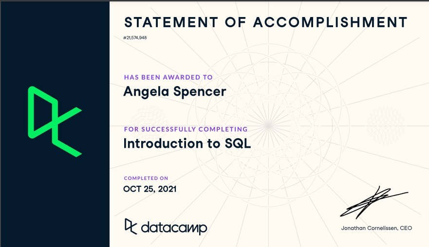

# Week_06
Week 6 - SQL- Part1

#5 In the readme for the repo explain what an RDBMS is and what SQL is briefly (under 250 words)
A database stores information in a way that is accessible, manageable, and updatable. A relational database stores information that is related in rows and columns.  A RDBMS is a system that provides an interface for people and programs to access data in the database in order to load, retrieve, and modify data.

Structured Query Language (SQL) is a language for interacting with relation databases. It allows users to query, view, and modify existing data.

#6 Also in the readme, embed a screenshot indicating you have completed the Introduction to SQL in DataCamp

Resources:
DATABASE READING
https://www.edureka.co/blog/what-is-a-database/
https://www.oracle.com/database/what-is-a-relational-database/#:~:text=A%20relational%20database%20is%20a,are%20related%20to%20one%20another.&text=The%20columns%20of%20the%20table,the%20relationships%20among%20data%20points.

VSC IMAGES
https://stackoverflow.com/questions/42961712/how-to-include-image-as-markdown-in-visual-studio-code

DATETIME FUNCTION / EXTRACT
https://www.sqltutorial.org/sql-date-functions/how-to-extract-day-from-date-in-sql/
https://www.postgresql.org/docs/9.1/functions-datetime.html

EXPLAIN function
https://www.postgresqltutorial.com/postgresql-explain/
http://postgresguide.com/performance/explain.html
https://thoughtbot.com/blog/reading-an-explain-analyze-query-plan

CREATE VIEW function
https://www.postgresql.org/docs/9.2/sql-createview.html
https://hasura.io/docs/latest/graphql/core/guides/postgres/views.html

